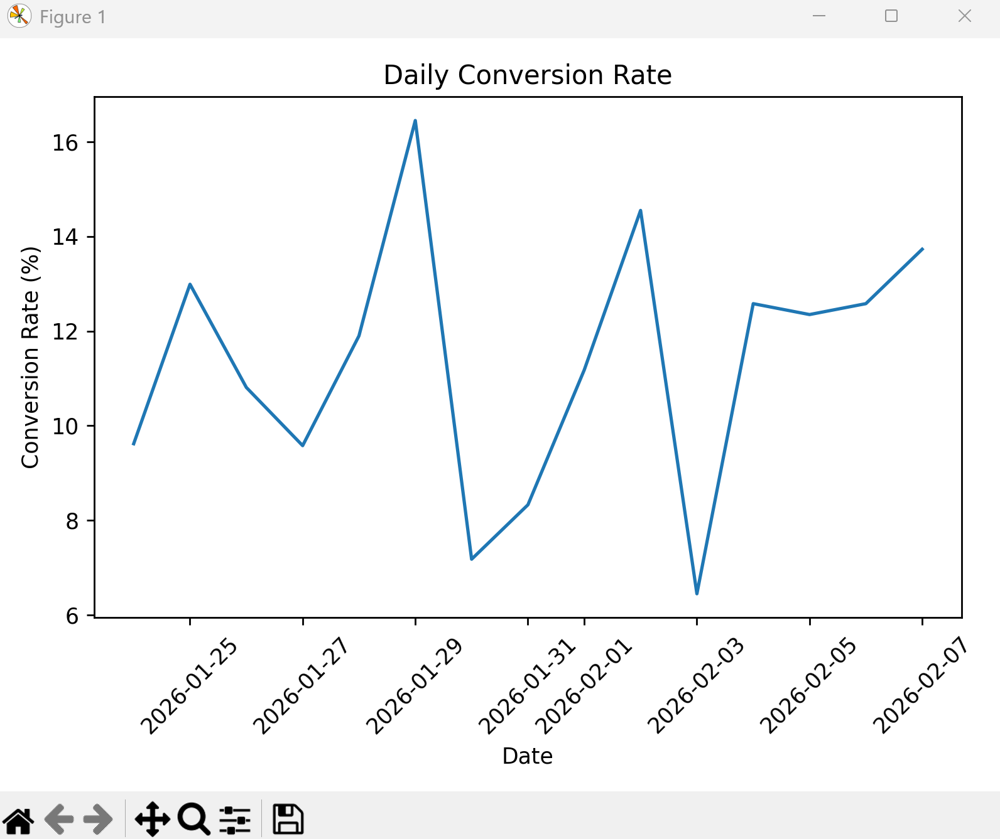
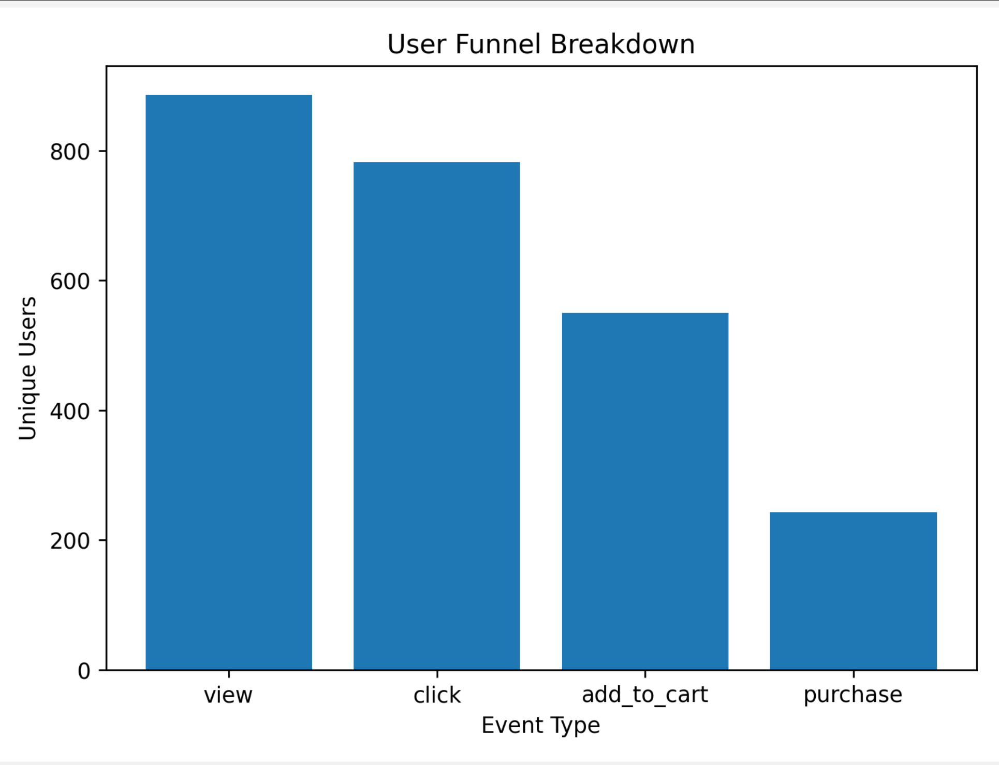
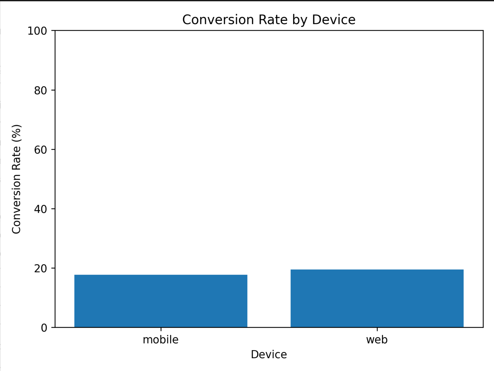
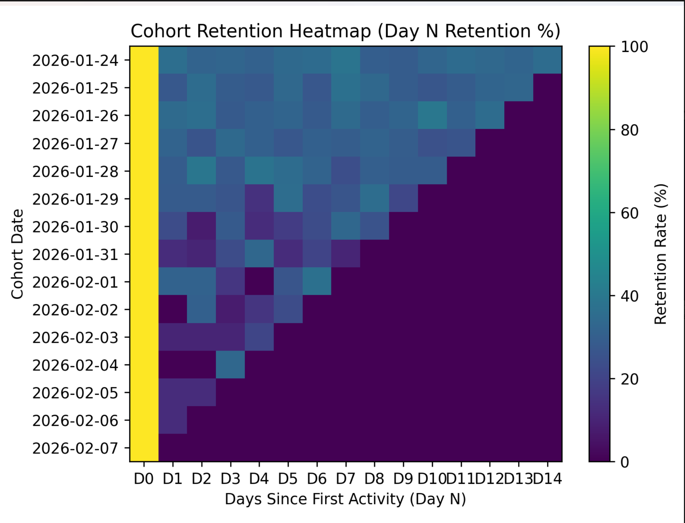

# End-to-End Product Analytics Pipeline

## Overview
This project implements an end-to-end product analytics pipeline that simulates user behavior for an e-commerce application and transforms raw event data into actionable business insights. The system captures user interactions, stores raw events, builds analytics-ready tables using SQL, and visualizes key performance metrics using Python.

The goal of this project is to demonstrate how data engineers and analysts enable product teams to understand user behavior, conversion trends, and revenue patterns.

---

## Problem Statement
Product teams often need answers to questions such as:
- How many users move through each stage of the funnel?
- Where do users drop off before conversion?
- How does conversion rate change over time?
- Are there differences in performance across devices?

This project addresses these questions by modeling realistic user activity and building a reproducible analytics workflow.

---

## Architecture
```text
Python Event Generator
        ↓
PostgreSQL (Raw Events Table)
        ↓
SQL Transformations
        ↓
Analytics Tables
        ↓
Python Visualizations
```
---

## Event Schema
Each user interaction is stored as a raw event with the following fields:

- `event_id` – Unique identifier for each event  
- `user_id` – Unique identifier for the user  
- `event_type` – One of: `view`, `click`, `add_to_cart`, `purchase`  
- `timestamp` – Time at which the event occurred  
- `device` – Device type (`web` or `mobile`)  
- `country` – User country  
- `amount` – Purchase amount (only for `purchase` events)  

---

## Data Storage
All events are stored in a PostgreSQL table (`events_raw`) as immutable raw data. No transformations are applied at ingestion time to preserve data fidelity and allow flexible downstream analysis.

---

## Analytics Tables
The following analytics-ready tables are derived from raw events using SQL:

- **funnel_daily_metrics**  
  Daily counts of users at each funnel stage along with overall conversion rate.

- **device_metrics**  
  Funnel counts and conversion rate grouped by device type.

- **user_revenue**  
  Total revenue generated per user, enabling identification of high-value users.

These tables support fast and repeatable querying for business analysis.

---

## Visualizations
The project includes Python-based visualizations generated using Pandas and Matplotlib:

- **Daily Conversion Rate**  
  Line chart showing how conversion rate varies across days. 
  

- **Funnel Breakdown**  
  Bar chart showing the number of users at each funnel stage.
  
- **Conversion Rate by Device**  
  Bar chart comparing conversion performance between mobile and web users.
  
- **Cohort retention analysis**
  Cohort retention analysis shows a sharp drop in user activity after Day 1, followed by a gradual decay in engagement. This suggests that while initial interest is high, long-term retention depends on improving early user experience and re-engagement strategies.
  


---

## Key Insights
- Daily conversion rates fluctuate over time, indicating variability in user behavior and potential sensitivity to traffic quality or funnel friction.
- Funnel analysis highlights significant drop-offs between early engagement and purchase stages.
- Device-level metrics show differences in conversion efficiency between mobile and web users.
- Revenue analysis reveals that a small subset of users contributes a disproportionate share of total revenue.

---

## Tech Stack
- **Python** – Event simulation and data visualization  
- **PostgreSQL** – Raw data storage and analytics tables  
- **SQL** – Data transformation and aggregation logic  
- **Pandas & Matplotlib** – Analysis and visualization  

---

## Future Improvements
- Migrate analytics layer to BigQuery or Snowflake  
- Orchestrate transformations using Apache Airflow  
- Add cohort-based retention analysis  
- Integrate real-time streaming ingestion  

---

This project demonstrates how raw product event data can be transformed into meaningful insights through thoughtful data modeling, SQL analytics, and clear visualization.
